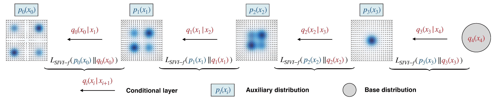

# Hierarchical Semi-Implicit Variational Inference with Application to Diffusion Model Acceleration

> [**Hierarchical Semi-Implicit Variational Inference with Application to Diffusion Model Acceleration**](https://openreview.net) **NIPS 2023** <br>
> Longlin Yu\*, Tianyu Xie\*, Yu Zhu\*, Tong Yang, Xiangyu Zhang and Cheng Zhang <br>

This repository contains the implementation for the paper [Hierarchical Semi-Implicit Variational Inference with Application to Diffusion Model Acceleration](https://openreview.net) (NIPS 2023). 

## Hierarchical Semi-Implicit Variational Inference
<div  align="center">    
 
</div>

> HSIVI is a variational inference method that assumes the target density is accessible (e.g., the density function up to a constant or the score function is available). 
When used for diffusion model acceleration, HSIVI-SM does not directly target the generative model. Instead, it requires a sequence of auxiliary distributions that bridges between a simple distribution and the target distribution which is available given the learned score functions of diffusion models (see Example 2 in the original paper).

## How to run the code
### 1. Dependencies
Before running our codes, please use the following commands to install the requirements.
```shell script
# python=3.8.16
pip install --upgrade pip
pip install -r requirements.txt -f https://download.pytorch.org/whl/torch_stable.html 
``` 
### 2. Multi-node Training
For multi-node training, the following environment variables need to be specified: `$IP_ADDR` is the IP address of the machine that will host the process with rank 0 during training (see here). `$NODE_RANK` is the index of each node among all the nodes.

### 3. Datasets
For the real image generation, we employ `MNIST`, `CIFAR10`, `Celeba64` and `ImageNet64` in this work. Note that HSIVI allows data-free training to accelerate diffusion model sampling. 

### 4. Pre-trained Noise Model
For diffusion model acceleration, we use the pre-trained noise model $\bm{\epsilon}^*(\bm{x},s)$ follows the UNet structure. 
More specifically, checkpoints of pre-trained $\bm{\epsilon}^*(\bm{x} ,s)$ we used can be downloaded from 
|Dataset|Download link|
|----|----|
|Cifar10| [checkpoints](https://github.com/tqch/ddpm-torch/releases/download/checkpoints/cifar10_2040.pt)|
|Celeba64| [checkpoints]()|
|Imagenet64| [checkpoints](https://openaipublic.blob.core.windows.net/diffusion/march-2021/imagenet64_uncond_100M_1500K.pt)|

### 5. Training
With the downloaded pre-trained models, train our models through `main.py`
```
main.py \
    -cc <path of training configuration file> \
    --root './' \
    --mode train \
    --n_gpus_per_node <number of GPUs per node> \
    --training_batch_size <training batch size on a single GPU>  \
    --testing_batch_size 16 \
    --sampling_batch_size 64 \
    --independent_log_gamma <dis|use> \
    --f_learning_times <number of f_net updates after per phi_net updates > \
    --image_gamma <dis|use> \ 
    --skip_type <type of beta > \ 
    --n_discrete_steps <number of funciton evaluations (NFE) + 1> \
    --phi_learning_rate <phi learning rate> \
    --f_learning_rate <f learning rate> \
    --n_train_iters <number of iteration> \
    --pretrained_model <path of pretrained model> \
    --workdir <path of working directory> \
    --master_address 127.0.0.10 \
    --master_port 4372
```
- `independent_log_gamma`: The meaning of'use' ('dis') is to use independnent (shared) log_gamma across different conditional layers.
- `image_gamma`: The meaning of'dis' ('use') is to use the isotropic ('non-isotropic') conditional layers.
- `skip_type`: Strategy of selecting the discrete time steps, 'uniform' and "quad" can be chosen.

For example, you can run the script to train HSIVI-SM on a single node with 8 GPUs (recommended) for `CIFAR10`:
```
python main.py \
    -cc configs/default_cifar.txt \
    --root './' \
    --mode train \
    --n_gpus_per_node 8 \
    --training_batch_size 16  \
    --testing_batch_size 16 \
    --sampling_batch_size 64 \
    --independent_log_gamma dis \
    --f_learning_times 20 \
    --image_gamma use \
    --skip_type quad \
    --n_discrete_steps 11 \
    --phi_learning_rate 0.000016 \
    --f_learning_rate 0.00008 \
    --n_train_iters 200000 \
    --pretrained_model ./pretrained_model/target_epsilon_cifar10.pt \
    --workdir ./work_dir/cifar10_10steps \
    --master_address 127.0.0.10 \
    --master_port 4372
```
We put the complete training scripts for different datasets separately in files `./run_celeba64.sh` ( for `Celeba64`), `./run_cifar10.sh` ( for `Cifar10`) and `./run_imagenet64.sh` ( for `ImageNet64`).
### 6. Evaluation
During the training process, the FID would be calculated precisely by sampling 50000 images. The pre-calculated FID statistics of CIFAR-10 has been put in `./inception/fid_stats_cifar10_train_pytorch.npz`.

After the training process, you can evaluate the FID of the generated samples of trained HSIVI model with the following script. 
```
python main.py \
    -cc <path of training configuration file> \
    --root './' \
    --mode eval \
    --n_gpus_per_node 8 \
    --training_batch_size <training batch size on a single GPU> \
    --workdir <path of working directory>\
    --eval_weight <path of checkpoints of trained epsilon model> \
    --n_discrete_steps <number of funciton evaluations (NFE) + 1>
```

### References
We referenced the training code of diffusion model acceleration for our models in the repository from [Score-Based Generative Modeling with Critically-Damped Langevin Diffusion](https://github.com/nv-tlabs/CLD-SGM). As for the evaluation code for FID, we used the code provided by [Elucidating the Design Space of Diffusion-Based Generative Models (EDM)](https://github.com/NVlabs/edm).

### Citation
If you find this code useful for your research, please consider citing
```
@inproceedings{
anonymous2023hierarchical,
title={Hierarchical Semi-Implicit Variational Inference with Application to Diffusion Model Acceleration},
author={Anonymous},
booktitle={Thirty-seventh Conference on Neural Information Processing Systems},
year={2023},
url={https://openreview.net/forum?id=ghIBaprxsV}
}
```